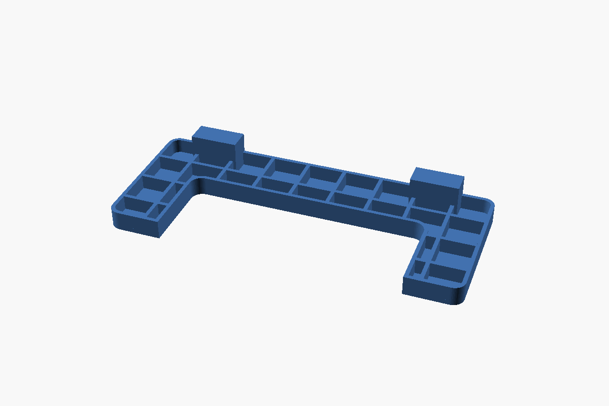
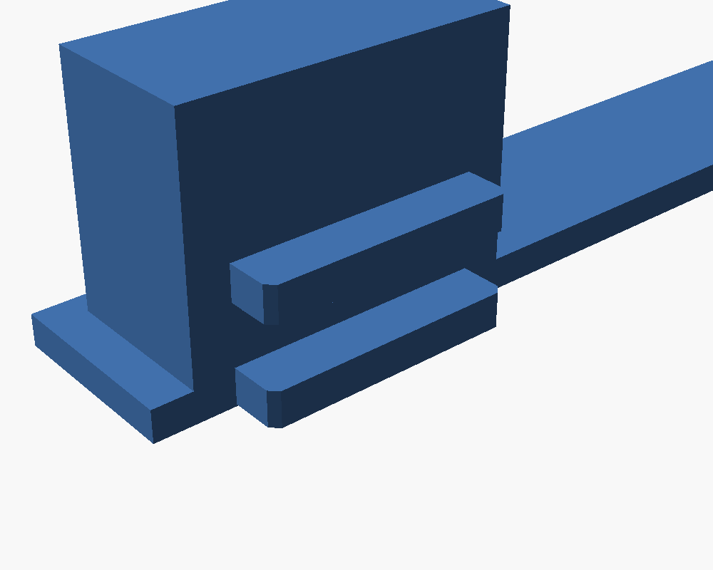

# Yealink T29G desk stand (3D-printable)

Parametric replacement for the OEM T29G stand. It prints flat with the ribs facing up and needs no supports.

| File | What it is |
|---|---|
| `t29_stand.scad` | Source model. Every dimension is a parameter at the top of the file. |
| `t29_fit_test.stl` | A thin strip with both tabs at their real spacing. **Print this first** (~15 min). |
| `t29_stand.stl` | The full stand at the default parameters. |



## Measured vs. estimated

Each tab is two parallel rails standing out from the stand's edge face. The rails run along the edge and are flush with one face of the stand.



| Parameter | Value | Source |
|---|---|---|
| `tab_w` | 19.0 mm | caliper, 18.94 mm (rail length along the edge) |
| `rail_span` | 10.11 mm | caliper, outside of one rail to outside of the other |
| `rail_gap` | 4.24 mm | caliper, gap between the rails |
| `rail_h` | 3.90 mm | caliper; my reading is that this is how far the rails stand out |
| `edge_h` | 20.50 mm | caliper, stand thickness at the tab |
| `tab_pitch` | 120 mm | **estimate from photo**, tab centre to centre |
| `stand_len` | 75 mm | **design choice**, sets the viewing angle |
| `stand_w` | 180 mm | design choice, foot to foot |

Also measured: 32.93 mm from the tab to the step in the outline, and 5.81 / 25.67 mm from the other step to each end of the other tab. These describe the OEM outline and aren't needed for the fit.

## Workflow

1. Print `t29_fit_test.stl` and push it into the phone's stand slots.
   * If the tabs are too tight or too loose, change `tab_clear` (default 0.15 mm per face).
   * If the tabs don't line up with the slots, change `tab_pitch` / `tab_offset`.
2. Re-render:
   ```
   openscad -D 'part="stand"'    -o t29_stand.stl    t29_stand.scad
   openscad -D 'part="fit_test"' -o t29_fit_test.stl t29_stand.scad
   ```
3. Print the stands in PETG or PLA with 3 walls and 20% infill. Add stick-on rubber bumpers to the feet.
